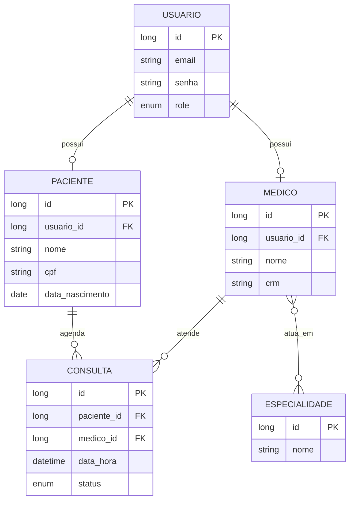

# 🏥 Medical Appointment API

API REST para agendamento de consultas médicas, desenvolvida como projeto de estudo e portfólio para consolidar boas práticas de desenvolvimento backend com Java e Spring Boot.

O sistema gerencia três perfis de usuário (Paciente, Médico e Administrador), com autenticação via JWT, autorização por perfil, e regras de negócio reais de agendamento — como impedir que um médico tenha duas consultas marcadas no mesmo horário.

---

## 📋 Sobre o projeto

Esse é meu segundo projeto backend, construído do zero com foco em entender **por que** cada peça existe, não só em fazer funcionar. Cada decisão de arquitetura — camadas, DTOs, tratamento de exceções, segurança — foi tomada de forma consciente, buscando reproduzir o processo de um time profissional: planejar antes de codar, entender o problema antes da solução, e validar cada etapa com testes.

## 🚀 Funcionalidades

- **Autenticação e autorização**
    - Cadastro de usuários com senha criptografada (BCrypt)
    - Login com geração de token JWT
    - Autorização por perfil (`ADMIN`, `MEDICO`, `PACIENTE`) em nível de endpoint
    - Prevenção de escalonamento de privilégio (apenas um ADMIN pode criar outro ADMIN)

- **Gestão de Pacientes e Médicos**
    - CRUD completo, com validação de dados (CPF, CRM únicos, formato de e-mail, etc.)
    - Vínculo de Médicos a múltiplas Especialidades

- **Agendamento de Consultas**
    - Impede agendar duas consultas no mesmo horário para o mesmo médico
    - Impede agendamento em datas/horários no passado
    - Cancelamento de consulta (com preservação de histórico — sem exclusão física)
    - Listagem de consultas por paciente e por médico

- **Documentação interativa** via Swagger/OpenAPI, com suporte a autenticação Bearer direto na interface

## 🛠️ Tecnologias

| Categoria | Tecnologias |
|---|---|
| Linguagem | Java 21 |
| Framework | Spring Boot 4 |
| Segurança | Spring Security, JWT (JJWT) |
| Persistência | Spring Data JPA, Hibernate, MySQL |
| Documentação | Springdoc OpenAPI (Swagger UI) |
| Testes | JUnit 5, Mockito |
| Build | Maven |
| Infraestrutura | Docker, Docker Compose |
| Outros | Lombok, Bean Validation |

## 🗂️ Modelo de dados



- `Usuario` guarda apenas dados de acesso (autenticação); `Paciente` e `Medico` guardam dados de perfil, vinculados via `OneToOne`.
- `Medico` e `Paciente` se relacionam com `Consulta` via `ManyToOne` — cada um pode ter várias consultas ao longo do tempo.
- `Medico` e `Especialidade` têm relação `ManyToMany`, resolvida através de uma tabela de junção gerada automaticamente pelo Hibernate.

## 🏗️ Arquitetura

O projeto segue uma arquitetura em camadas, com responsabilidades bem separadas:

```
Controller  → recebe requisições HTTP e valida o formato dos dados
   ↓
Service     → aplica as regras de negócio (validações, cálculos, autorizações condicionais)
   ↓
Repository  → acessa o banco de dados via Spring Data JPA
   ↓
MySQL
```

Cada Entity possui DTOs de entrada e saída separados — a senha do usuário, por exemplo, nunca é exposta em nenhuma resposta da API, mesmo criptografada.

## 🔒 Destaques de segurança

- Senhas armazenadas com hash **BCrypt** (nunca em texto puro)
- Autenticação **stateless** via JWT — nenhuma sessão é mantida no servidor
- Autorização granular por perfil usando `@PreAuthorize`
- Correção proativa de uma falha de escalonamento de privilégio identificada durante o desenvolvimento: sem essa correção, qualquer pessoa não autenticada poderia se cadastrar diretamente como `ADMIN`

## ✅ Testes automatizados

Testes unitários com JUnit 5 e Mockito cobrindo as regras de negócio mais importantes dos Services, incluindo:

- Impedimento de conflito de horário na mesma consulta médica
- Impedimento de agendamento em datas passadas
- Prevenção de duplicidade de e-mail, CPF e CRM

```
✔ ConsultaServiceTest
  ✔ deveLancarExcecaoQuandoHorarioJaOcupado
  ✔ deveLancarExcecaoQuandoDataNoPassado
```

## 📸 Demonstração

<!-- Substitua os caminhos abaixo pelos prints salvos em uma pasta /docs/images no seu repositório -->

**Visão geral da API no Swagger UI**


**Cadastro de usuário — senha nunca é exposta na resposta**


**Agendamento de consulta com sucesso**


**Autorização por perfil bloqueando ação não permitida (403)**


**Testes automatizados passando**


**Dados persistidos no banco (MySQL via DBeaver)**


## ▶️ Como executar o projeto

### Pré-requisitos
- Java 21
- Docker e Docker Compose
- Maven (ou use o `mvnw` incluído no projeto)

### Passo a passo

1. Clone o repositório:
```bash
git clone https://github.com/yagosiqueira-dev/medical-appointment-api.git
cd medical-appointment-api
```

2. Suba o banco de dados MySQL com Docker:
```bash
docker compose up -d
```

3. Rode a aplicação:
```bash
./mvnw spring-boot:run
```

4. Acesse a documentação interativa da API:
```
http://localhost:8080/swagger-ui/index.html
```

5. Para testar endpoints protegidos: cadastre um usuário via `POST /api/usuarios`, faça login via `POST /login`, copie o token retornado e clique em **Authorize** no Swagger UI para autenticar as próximas requisições.

## 📌 Principais endpoints

| Método | Rota | Descrição | Autenticação |
|---|---|---|---|
| POST | `/api/usuarios` | Cadastra um novo usuário | Pública |
| POST | `/login` | Autentica e retorna um token JWT | Pública |
| GET/POST | `/api/medicos` | Lista ou cadastra médicos | Autenticado (cadastro: ADMIN) |
| GET/POST | `/api/pacientes` | Lista ou cadastra pacientes | Autenticado |
| GET/POST | `/api/especialidades` | Lista ou cadastra especialidades | Autenticado (cadastro: ADMIN) |
| POST | `/api/consultas` | Agenda uma nova consulta | PACIENTE ou ADMIN |
| PATCH | `/api/consultas/{id}/cancelar` | Cancela uma consulta | PACIENTE, MEDICO ou ADMIN |
| GET | `/api/consultas/paciente/{id}` | Lista consultas de um paciente | PACIENTE ou ADMIN |
| GET | `/api/consultas/medico/{id}` | Lista consultas de um médico | MEDICO ou ADMIN |

## 🔭 Próximos passos

- [ ] Testes de integração dos Controllers
- [ ] Refinar autorização de `Paciente` (garantir que um paciente só possa se autocadastrar vinculado ao próprio usuário)
- [ ] Considerar duração da consulta na validação de conflito de horário
- [ ] Dockerfile da própria aplicação, permitindo subir tudo (API + banco) com um único `docker compose up`

## 👤 Autor

**Yago Machado Siqueira**
Estudante de Análise e Desenvolvimento de Sistemas

[LinkedIn](#) · [GitHub](https://github.com/yagosiqueira-dev)